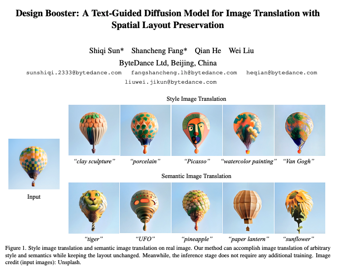

# Unofficial implementation of Design Booster
This is an unofficial implementation of [Design Booster](https://arxiv.org/abs/2302.02284) using [d🧨ffusers](https://github.com/huggingface/diffusers) by [mkshing](https://twitter.com/mk1stats).
In that paper, DesignBooster is trained on a large dataset such as LAION. But I am wondering if it's applicable to small dataset as well such as Dreambooth and here it is!

I am happy to get any feedbacks! 



> Diffusion models are able to generate photorealistic images in arbitrary scenes. However, when applying diffusion models to image translation, there exists a trade-off between maintaining spatial structure and high-quality content. Besides, existing methods are mainly based on test-time optimization or fine-tuning model for each input image, which are extremely time-consuming for practical applications. To address these issues, we propose a new approach for flexible image translation by learning a layout-aware image condition together with a text condition. Specifically, our method co-encodes images and text into a new domain during the training phase. In the inference stage, we can choose images/text or both as the conditions for each time step, which gives users more flexible control over layout and content. Experimental comparisons of our method with state-of-the-art methods demonstrate our model performs best in both style image translation and semantic image translation and took the shortest time.

## Installation
You need [x-transformers](https://github.com/lucidrains/x-transformers) by lucidrains additionally. 
```commandline
$ pip install -r requirements.txt
```


## Train Design Booster

```commandline
accelerate launch train_designbooster.py \
  --pretrained_model_name_or_path=$MODEL_NAME \
  --revision="fp16" \
  --mixed_precision="fp16" \
  --resolution=512 \
  --train_batch_size=1 \
  --use_8bit_adam \
  --instance_data_dir=$INSTANCE_DATA_DIR \
  --class_data_dir=$CLASS_DATA_DIR \
  --output_dir="/content/designbooster" \
  --with_prior_preservation --prior_loss_weight=1.0 \
  --instance_prompt="a portrait of sks" \
  --class_prompt="a portrait" \
  --learning_rate=1e-6 \
  --lr_scheduler="constant" \
  --lr_warmup_steps=0 \
  --num_class_images=$NUM_CLASS_IMAGES \
  --max_train_steps=4000
```

## Inference
Please see `txt2img.py`

## Modules
### DesignBoosterModel
```python
from transformers import AutoTokenizer
from modeling_designbooster import DesignBoosterConfig, DesignBoosterModel

model_id = "CompVis/stable-diffusion-v1-4"
config = DesignBoosterConfig.from_pretrained(model_id, subfolder="text_encoder")
config.num_image_prompt_tokens = 20
config.num_channels = 4
model = DesignBoosterModel.from_pretrained(model_id, subfolder="text_encoder", config=config)
tokenizer = AutoTokenizer.from_pretrained(model_id, subfolder="tokenizer")
pixel_values = torch.randn((2, 4, 64, 64))
input_ids = tokenizer(
    ["hello world", "hello Japan"],
    truncation=True,
    padding="max_length",
    max_length=tokenizer.model_max_length,
    return_tensors="pt",
).input_ids

out = model(input_ids=input_ids, pixel_values=pixel_values)[0]
print(out.shape)
# (bsz, 77+num_image_prompt_tokens, 768)
model.save_pretrained('encoder')
model = DesignBoosterModel.from_pretrained('encoder')
```
